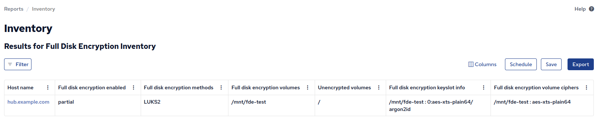

Full disk encryption (FDE) protects data at rest by encrypting entire block devices.
This module detects mounted volumes backed by dm-crypt (LUKS1, LUKS2, or plain dm-crypt) on Linux systems and reports whether all, some, or none of the non-virtual block device filesystems are encrypted.

Basic detection (encryption status, method, volume lists) is performed entirely through virtual filesystem reads (`/sys/block/` and `/proc/mounts`).
When `dmsetup` and `cryptsetup` are available, the module additionally reports the active cipher and LUKS keyslot details (per-keyslot cipher and PBKDF algorithm).

## How it works

1. Enumerates device-mapper block devices from `/sys/block/dm-*`
2. Reads each device's DM subsystem UUID from `/sys/block/dm-N/dm/uuid`
3. Identifies crypt devices by the `CRYPT-` prefix in the UUID
4. Parses `/proc/mounts` to find all non-virtual block device mounts (excluding loop devices)
5. Classifies each mount as encrypted or unencrypted by checking if its device matches a crypt device path
6. If `dmsetup` is available, reads the active cipher from `dmsetup table` for each crypt device
7. If `cryptsetup` is available, reads LUKS keyslot metadata (cipher and PBKDF per slot) via `cryptsetup luksDump`

## Inventory

- **Full disk encryption enabled** - `yes` if all non-virtual block device filesystems are encrypted, `partial` if some are encrypted and some are not, `no` if none are encrypted.
- **Full disk encryption methods** - The encryption type(s) detected, e.g. `LUKS2`, `LUKS1`, `PLAIN`. Empty list when no encryption is found.
- **Full disk encryption volumes** - List of mountpoints backed by encrypted devices.
- **Unencrypted volumes** - List of mountpoints on non-virtual block devices that are not encrypted.
- **Full disk encryption volume ciphers** - The active dm-crypt cipher per volume, e.g. `/ : aes-xts-plain64`. Requires `dmsetup`.
- **Full disk encryption keyslot info** - LUKS keyslot cipher and PBKDF per volume, e.g. `/ : 0:aes-xts-plain64/argon2id`. Requires `cryptsetup`. Not available for plain dm-crypt (no keyslots).

[](inventory-fde-mission-portal.png)

## Example

A system with LUKS2-encrypted root but unencrypted `/boot` and `/boot/efi`:

```
$ sudo cf-agent -Kf ./inventory-fde.cf --show-evaluated-vars=inventory_fde
Variable name                            Variable value                                               Meta tags                                Comment
inventory_fde:main.fde_enabled           partial                                                      source=promise,inventory,attribute_name=Full disk encryption enabled
inventory_fde:main.fde_method             {"LUKS2"}                                                    source=promise,inventory,attribute_name=Full disk encryption methods
inventory_fde:main.fde_volumes            {"/"}                                                       source=promise,inventory,attribute_name=Full disk encryption volumes
inventory_fde:main.unencrypted_volumes    {"/boot","/boot/efi"}                                       source=promise,inventory,attribute_name=Unencrypted volumes
inventory_fde:main.fde_volume_cipher      {"/ : aes-xts-plain64"}                                      source=promise,inventory,attribute_name=Full disk encryption volume ciphers
inventory_fde:main.fde_keyslot_info       {"/ : 0:aes-xts-plain64/argon2id"}                           source=promise,inventory,attribute_name=Full disk encryption keyslot info
```

## Testing

A helper script is included to create and tear down a LUKS2 test volume on a loopback device:

```
sudo ./test-encrypted-volume.sh setup     # Create and mount test volume
sudo cf-agent -KIf ./inventory-fde.cf --show-evaluated-vars=inventory_fde
sudo ./test-encrypted-volume.sh teardown  # Clean up
```

## Platform

- Linux only (requires `/sys/block/` and `/proc/mounts`)
- Cipher and keyslot inventory requires `dmsetup` and/or `cryptsetup` (typically available on systems with dm-crypt)
