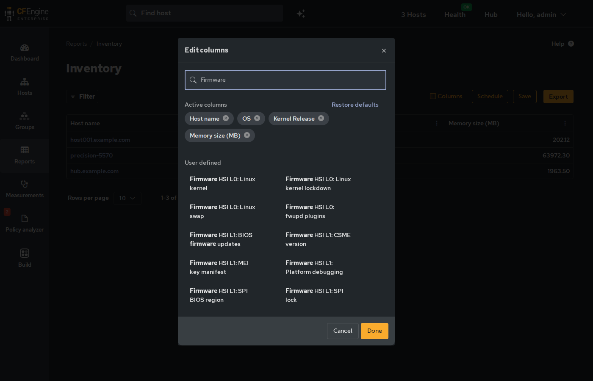
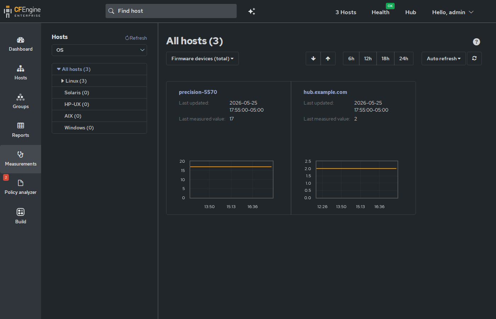

Surface fwupd state as inventory attributes: current firmware versions
and vendors, pending updates from LVFS, and Host Security Identifier
(HSI) security posture.

Pair with *manage-fwupd* to optionally apply firmware updates for
devices matching an allow-list.

* Requirements

- Linux (silently no-ops on other platforms)
- =fwupd= package for full functionality (manage-fwupd installs it
  automatically). Without fwupd, the module still runs but reports
  =Firmware update status= as =FWUPD_MISSING=.
- =fwupd-refresh.timer= enabled so the LVFS firmware catalog stays
  current (manage-fwupd handles this automatically)

* Mission Portal

The inventory attributes appear in Mission Portal's column selector
under "fwupd":

* Inventory Attributes

** Rolled-up status

| Attribute                  | Values                                                          |
|----------------------------+-----------------------------------------------------------------|
| *Firmware update status*   | =OK= -- no pending updates                                     |
|                            | =UPDATES_AVAILABLE= -- one or more devices have pending updates |
|                            | =NO_DEVICES= -- fwupd present but no updatable devices          |
|                            | =FWUPD_MISSING= -- fwupd is not installed                       |

** Per-device attributes

For every device fwupd reports (keyed by DeviceId):

| Attribute                          | Format                                                  |
|------------------------------------+---------------------------------------------------------|
| *Firmware devices*                 | =Name | Vendor | vX.Y.Z | [plugin]=                     |
| *Firmware device pending update*   | =Name: current -> new= (only when an update is pending) |

** HSI attributes

| Attribute                       | Format                                                     |
|---------------------------------+------------------------------------------------------------|
| *Firmware HSI level*            | =HSI:0= through =HSI:4=                                   |
| *Firmware HSI L<n>: <Name>*     | =PASS= or =FAIL= (one per security check)                 |
| *Firmware HSI attributes*       | =Name (HSI L<level>): <result> [PASS|FAIL]= (slist)       |

*Firmware HSI level* is the rolled-up Host Security Identifier level.
fwupd walks levels 1--4 sequentially; the result is the highest level
where all attributes pass, stopping at the first level with any failure.

*Firmware HSI L<n>: <Name>* variables (e.g. =Firmware HSI L1: TPM v2.0=)
are individual string attributes with value =PASS= or =FAIL=. These are
consumed by *compliance-report-fwupd* for per-check compliance conditions.
Two normalizations are applied to keep inventory attribute names stable
and aligned with the HSI specification:

- *Name normalization:* The CSME version attribute is emitted as
  =Firmware HSI L1: CSME version= regardless of the firmware version
  string fwupd reports (which varies per host).
- *Level normalization:* fwupd marks some runtime checks at HsiLevel 0
  even though they contribute to scored HSI levels. The module maps
  these to their specification levels: =UEFI secure boot= is emitted
  at L1 (not L0) and =CET OS Support= at L3 (not L0).

*Firmware HSI attributes* is an slist with one detailed entry per
security check, useful for drill-down in Mission Portal inventory views.

* Measurements

The following values are emitted as =cf-monitord= measurements for
time-series tracking in Mission Portal:

| Measurement                      | Units   | Description                             |
|----------------------------------+---------+-----------------------------------------|
| =firmware_devices_total=         | devices | Number of devices fwupd is tracking     |
| =firmware_updates_available=     | devices | Number of devices with a pending update |
| =firmware_hsi_failing=           | checks  | Number of failing HSI security checks   |

These appear in Mission Portal monitoring graphs as
=firmware_devices_total=, =firmware_updates_available=, and
=firmware_hsi_failing=.

* Classes

The module defines namespace-scoped classes for platform-specific
compliance report targeting:

| Class                    | Source                         | Matches                        |
|--------------------------+--------------------------------+--------------------------------|
| =fwupd_cpu_vendor_intel= | =/proc/cpuinfo= vendor_id      | =GenuineIntel=                 |
| =fwupd_cpu_vendor_amd=   | =/proc/cpuinfo= vendor_id      | =AuthenticAMD=                 |
| =fwupd_oem_vendor_hp=    | =/sys/class/dmi/id/sys_vendor= | =HP Inc.= or =Hewlett-Packard= |

These classes are used by *compliance-report-fwupd* =host_filter=
fields to restrict Intel-only, AMD-only, and HP-only conditions to
the relevant hardware.

* Limitations

The module is /read-only/ -- it never applies firmware updates.
Use *manage-fwupd* for that.

