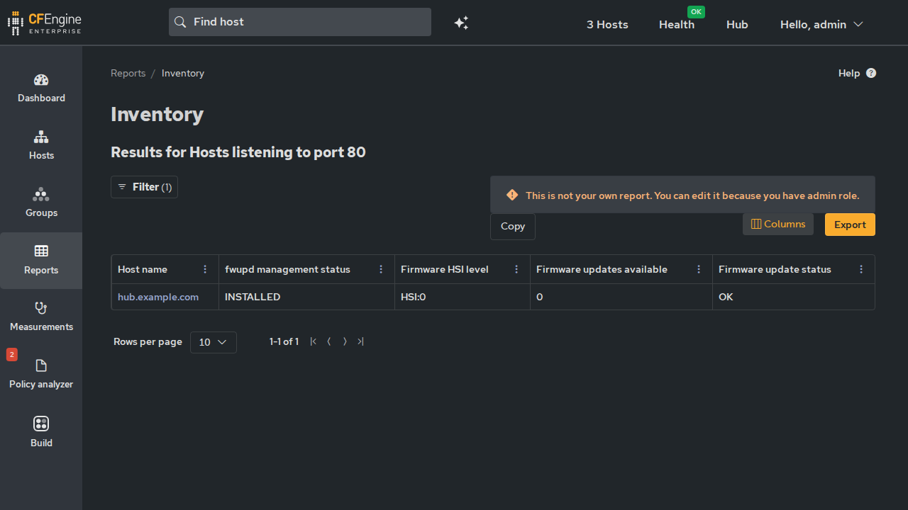

Ensure fwupd is installed and its metadata refresh timer is enabled.
Optionally apply firmware updates for devices matching an allow-list.

Depends on *inventory-fwupd*, which surfaces firmware versions,
pending updates, and HSI security attributes as inventory. This module
reads the updates cache that inventory-fwupd maintains rather than
calling fwupdmgr itself, avoiding duplicate work.

* Inputs

All three inputs live in the =manage_fwupd:allowed= bundle and can be
set via ~cfbs input~ (interactive), augments (=def.json=), CMDB, or
host-specific data. The variable names are:

| Variable                                   | Type                     | Default       |
|--------------------------------------------+--------------------------+---------------|
| =manage_fwupd:allowed.apply_updates=       | string (class expression) | =!any=       |
| =manage_fwupd:allowed.device_name_reglist= | list (pcre patterns)     | ={}= (empty)  |
| =manage_fwupd:allowed.reboot_after_update= | string (class expression) | =!any=       |

*Augments example* (=def.json=):

#+begin_src json
{
  "variables": {
    "manage_fwupd:allowed.apply_updates": {
      "value": "any"
    },
    "manage_fwupd:allowed.device_name_reglist": {
      "value": ["UEFI dbx", "System Firmware"]
    },
    "manage_fwupd:allowed.reboot_after_update": {
      "value": "Night"
    }
  }
}
#+end_src

** Apply firmware updates

A CFEngine class expression controlling when firmware updates are applied.
The default is =!any=, which means updates are never applied until you
explicitly opt in by changing this value.

Examples:

| Expression                                      | Meaning                                             |
|-------------------------------------------------+-----------------------------------------------------|
| =!any=                                          | Disabled (default) -- never apply firmware updates  |
| =any=                                           | Apply on all hosts, always                          |
| =linux=                                         | Apply on all Linux hosts                            |
| =(env_dev\vert{}env_qa).Night.(cohort_A\vert{}cohort_C)= | Dev/QA environments, at night, for cohorts A and C  |
| =Hr04.Min00_05=                                 | All hosts, but only during a 4:00--4:05 AM window   |
| =laptop_updates_enabled=                        | Only hosts where you've defined this custom class   |

Use =.= for AND, =|= for OR, =!= for NOT, and parentheses for grouping.
These are CFEngine class expressions, not regular expressions.

** Allowed devices

A list of device name patterns (regular expressions) controlling which
devices are eligible for firmware updates. Even when =apply_updates= is
enabled, only devices whose name matches an entry in this list will be
updated.

Use =.*= to match all devices. Use specific patterns to target individual
hardware, e.g. =UEFI dbx=, =System Firmware=, =TPM=.

** Reboot after update

A CFEngine class expression controlling when the host reboots after a
firmware update is applied. The default is =!any= (disabled). Some firmware
updates (e.g. UEFI capsule) only activate after a reboot.

When enabled, the module waits for cf-agent to finish before rebooting.
On systemd systems this uses a transient service that polls for cf-agent's
PID to exit, then reboots immediately. On non-systemd systems it falls
back to ~shutdown -r +1~.

* Mission Portal

The module reports =fwupd management status= as an inventory attribute
visible in Mission Portal's inventory reports:

* Behavior

1. *Always:* Ensures the =fwupd= package is installed
2. *Always:* Ensures =fwupd-refresh.timer= is enabled (keeps the LVFS firmware catalog current)
3. *When =apply_updates= class resolves true AND a device matches the allow-list:*
   Runs ~fwupdmgr update --no-reboot-check <device-id>~ for each matching device.
   A marker file prevents the same update from re-executing within the
   same boot cycle.
4. *When =reboot_after_update= resolves true AND a firmware update was applied:*
   Schedules a deferred reboot after cf-agent exits.

The =--no-reboot-check= flag suppresses the interactive reboot prompt.
It does not skip or defer the update itself.

* Requirements

Linux only. The =fwupd= package must be available in the system's
package repositories.

* Warnings

Firmware updates carry inherent risk (bricking, required reboots, AC
power requirements). Use the allow-list to limit updates to
well-understood device classes. Test in a non-production environment
first.
