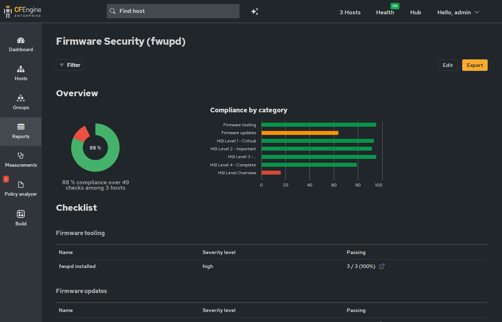

Compliance report definition for firmware security posture via fwupd.

Imports a "Firmware Security (fwupd)" report into Mission Portal that
tracks Host Security Identifier (HSI) levels, fwupd installation, and
firmware update status across the fleet.

The report contains 49 conditions: 7 rolled-up checks (HSI level
thresholds, fwupd installation, update status) and 42 per-attribute
checks covering every individual HSI firmware security test.

* Mission Portal

* Requirements

- *inventory-fwupd* module providing the inventory attributes and
  platform classes (=fwupd_cpu_vendor_intel=, =fwupd_cpu_vendor_amd=,
  =fwupd_oem_vendor_hp=) that the compliance conditions reference
- *compliance-report-imports* autorun bundle on the hub to import
  the JSON definition into Mission Portal

* Rolled-up Conditions

| Condition                         | Category           | Severity |
|-----------------------------------+--------------------+----------|
| *fwupd installed*                 | Firmware tooling   | high     |
| *HSI Level 1+ (Critical)*        | HSI Level Overview | high     |
| *HSI Level 2+ (Important)*       | HSI Level Overview | medium   |
| *HSI Level 3+ (Recommended)*     | HSI Level Overview | low      |
| *HSI Level 4 (Complete)*         | HSI Level Overview | low      |
| *No pending firmware updates*    | Firmware updates   | medium   |
| *Firmware status healthy*        | Firmware updates   | medium   |

HSI level checks are cumulative thresholds -- a host at HSI:3 passes
the Level 1+, 2+, and 3+ conditions but fails Level 4.

* Per-Attribute Conditions

Each individual HSI firmware security check is a separate compliance
condition. The inventory attribute name follows the pattern
=Firmware HSI L<level>: <Name>= with value =PASS= or =FAIL=.

Per-attribute conditions use ~condition_for: "failing"~ -- a host is
only marked failing when the attribute is explicitly =FAIL=. Hosts
that don't report a given attribute (e.g., Intel-only checks on AMD
hardware, or VMs without HSI data) show as "not evaluated" rather
than failing. The checks are defined by the
[[https://fwupd.github.io/libfwupdplugin/hsi.html][fwupd HSI specification]].

** Level 1 -- Critical (19 conditions, severity: high)

| Condition                    | Inventory attribute                        | Platform |
|------------------------------+--------------------------------------------+----------|
| UEFI SecureBoot              | =Firmware HSI L1: UEFI secure boot=       | All      |
| TPM 2.0 Present              | =Firmware HSI L1: TPM v2.0=               | All      |
| Empty PCR in TPM             | =Firmware HSI L1: TPM empty PCRs=         | All      |
| UEFI Platform Key            | =Firmware HSI L1: UEFI platform key=      | All      |
| BIOS Capsule Updates         | =Firmware HSI L1: BIOS firmware updates=  | All      |
| Supported CPU                | =Firmware HSI L1: Supported CPU=          | All      |
| UEFI BootService Variables   | =Firmware HSI L1: UEFI bootservice variables= | All  |
| BIOS Write Enable (BWE)      | =Firmware HSI L1: SPI write=              | Intel    |
| BIOS Lock Enable (BLE)       | =Firmware HSI L1: SPI lock=               | Intel    |
| SMM BIOS Write Protect       | =Firmware HSI L1: SPI BIOS region=        | Intel    |
| Read-only SPI Descriptor     | =Firmware HSI L1: SPI descriptor=         | Intel    |
| Platform Debug (Intel DCI)   | =Firmware HSI L1: Platform debugging=     | Intel    |
| ME Manufacturing Mode        | =Firmware HSI L1: csme manufacturing mode= | Intel   |
| ME Flash Descriptor Override | =Firmware HSI L1: csme override=          | Intel    |
| ME BootGuard Platform Key    | =Firmware HSI L1: MEI key manifest=       | Intel    |
| CSME Version                 | =Firmware HSI L1: CSME version=           | Intel    |
| Part is Fused                | =Firmware HSI L1: Part is fused=          | Intel    |
| AMD Microcode Signature      | =Firmware HSI L1: AMD microcode signature= | AMD     |
| SMM Locked Down              | =Firmware HSI L1: SMM locked down=        | AMD      |

** Level 2 -- Important (12 conditions, severity: medium)

| Condition                  | Inventory attribute                             | Platform |
|----------------------------+-------------------------------------------------+----------|
| DMA Protection (IOMMU)     | =Firmware HSI L2: IOMMU=                        | All      |
| PCR0 TPM Event Log         | =Firmware HSI L2: TPM PCR0 reconstruction=      | All      |
| BIOS Rollback Protection   | =Firmware HSI L2: BIOS rollback protection=     | All      |
| Intel BootGuard Enabled    | =Firmware HSI L2: Intel BootGuard=              | Intel    |
| Intel BootGuard Verified   | =Firmware HSI L2: Intel BootGuard verified boot= | Intel   |
| Intel BootGuard ACM        | =Firmware HSI L2: Intel BootGuard ACM protected= | Intel   |
| Intel BootGuard OTP        | =Firmware HSI L2: Intel BootGuard OTP fuse=     | Intel    |
| Part is Debug Locked       | =Firmware HSI L2: Platform debugging=           | Intel    |
| Intel GDS Mitigation       | =Firmware HSI L2: Intel GDS mitigation=         | Intel    |
| AMD Platform Secure Boot   | =Firmware HSI L2: AMD platform secure boot=     | AMD      |
| AMD SPI Write Protections  | =Firmware HSI L2: AMD SPI write protections=    | AMD      |
| HP SureStart               | =Firmware HSI L2: HP SureStart=                 | HP       |

** Level 3 -- Recommended (8 conditions, severity: low)

| Condition                          | Inventory attribute                          | Platform |
|------------------------------------+----------------------------------------------+----------|
| Suspend-to-Idle                    | =Firmware HSI L3: Suspend-to-idle=           | All      |
| Suspend to RAM Disabled            | =Firmware HSI L3: Suspend-to-ram=            | All      |
| Pre-boot DMA Protection           | =Firmware HSI L3: Pre-boot DMA protection=  | All      |
| CET Available                      | =Firmware HSI L3: CET Platform=             | All      |
| CET Utilized by OS                | =Firmware HSI L3: CET OS Support=           | All      |
| Early-boot UEFI Memory Protections | =Firmware HSI L3: UEFI memory protections=  | All      |
| Intel BootGuard Policy             | =Firmware HSI L3: Intel BootGuard error policy= | Intel |
| AMD SPI Replay Protections        | =Firmware HSI L3: AMD SPI replay protections= | AMD    |

** Level 4 -- Complete (3 conditions, severity: low)

| Condition                     | Inventory attribute                        | Platform |
|-------------------------------+--------------------------------------------+----------|
| DRAM Memory Encryption        | =Firmware HSI L4: Encrypted RAM=           | All      |
| SMAP                          | =Firmware HSI L4: SMAP=                    | All      |
| AMD Secure Processor Rollback | =Firmware HSI L4: AMD rollback protection= | AMD      |

* Categories

| Category                  | Conditions | Scope                      |
|---------------------------+------------+----------------------------|
| HSI Level Overview        |          4 | Rolled-up level thresholds |
| HSI Level 1 - Critical    |         19 | Per-attribute checks       |
| HSI Level 2 - Important   |         12 | Per-attribute checks       |
| HSI Level 3 - Recommended |          8 | Per-attribute checks       |
| HSI Level 4 - Complete    |          3 | Per-attribute checks       |
| Firmware updates           |          2 | Update status              |
| Firmware tooling           |          1 | fwupd installation         |

* Platform support

Linux only. Platform-specific conditions use =host_filter= class
expressions so they only activate on relevant hardware:

| Platform | =host_filter=              | Conditions | Detection                      |
|----------+----------------------------+------------+--------------------------------|
| All      | =linux=                    |         25 | --                             |
| Intel    | =fwupd_cpu_vendor_intel=   |         17 | =/proc/cpuinfo= vendor_id      |
| AMD      | =fwupd_cpu_vendor_amd=     |          6 | =/proc/cpuinfo= vendor_id      |
| HP       | =fwupd_oem_vendor_hp=      |          1 | =/sys/class/dmi/id/sys_vendor= |

These classes are defined by the *inventory-fwupd* module.
